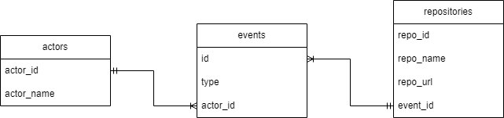

# Project Week3: Building an ETL Pipeline for a Cloud Data Warehouse (Google BigQuery)

## What we do in this project?
We will extract data from each json file, transform some of data into the new columns, and load transformed data into each table in Google BigQuery.

## Data Modeling

## File in the project
1. requirements.txt:  Use for install neccesary library
2. etl_bigquery.py:  Use for create events table and ETL data into it
3. etl_bigquery_act.py:  Use for create actors table and ETL data into it
4. etl_bigquery_rep.py:  Use for create repositories table and ETL data into it
5. github_events_01.json - github_events_05.json (5 files):  Data for ETL process

## Instruction
1. Please check you path that Is is in "03-building-a-data-warehouse"? 
-> If yes, please skip to the next step
-> Unless, Please run this code in terminal: $ cd 03-building-a-data-warehouse for chaging path first
2. Create environment:
   -> $ python -m vene ENV
   -> $ source ENV/bin/activate
3. Install neccesary library:
   -> $ pip install -r requirements.txt
4. Insert your creditial file in GitHub
5. Config details in etl_bigquery.py, etl_bigquery_act.py, and, etl_bigquery_rep.py as follows:
   -> keyfile (line 40) - change path of creditial file
   -> project_id (line 46) - change to your project name which was created in Google BigQuery
6. Finished for initialization, You can run these codes to create table, extract, transform, and load data.
   -> $ python etl_bigquery.py
   -> $ python etl_bigquery_act.py
   -> $ python etl_bigquery_rep.py
