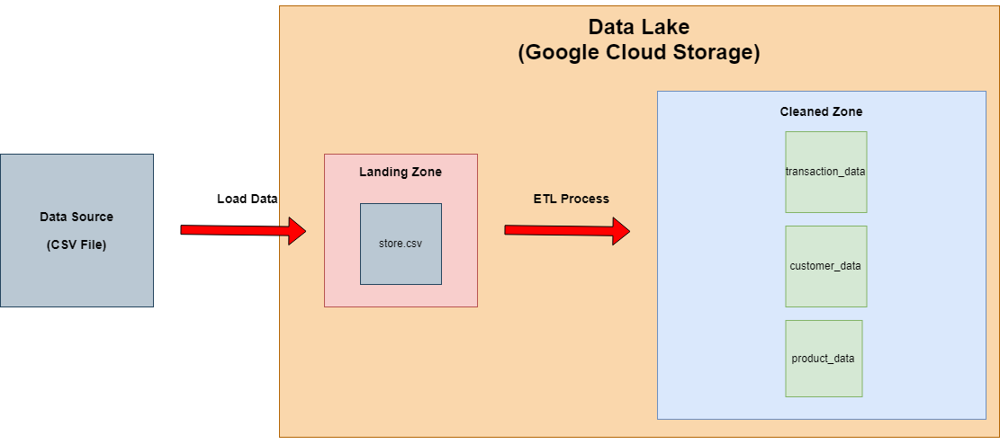

# Project Week4: Building an ETL Pipeline to Transform Data in Data Lake (From Landing Zone to Cleaned Zone)

## What we do in this project?
We will extract and transform raw data from landing zone and loan into cleaned zone in data lake. In this project we use Google Cloud Storage (GCS) to be our data lake.

## What we do during ETL process?
- To rename column name into lower case and replace space with underscrore(_).
- To split ship mode column by keeping only its mode name.
- To split order date and ship date columns and transform it into new format = "yyyy-mm-dd" instead of "dd-mm-yyyy".
- To do normalization with data by splitting it to 3 tables which are transaction_data, customer_data, and product_data. For customer_dat and product_data, we will select only unique values.
- To export them as CSV files and save in Google Cloud Storage.

## Data Modeling

## File in the project
1. docker-compose.yml:  Use for install Pyspark in Jupyter notebook.
2. etl_gcs.ipynb:  Use for process ETL.
3. store.csv:  Dataset which was used in this time.

## Instruction
**Instruction for Google Cloud Storage**
- You need to create bucket and upload "store.csv" in your bucket before process in Codespaces.

**Instruction for Codespaces**
1. Please check you path that Is is in "04-building-a-data-lake"? 
-> If yes, please skip to the next step
-> Unless, Please run this code in terminal: $ cd 02-data-modeling-ii for chaging path first
2. Install Pyspark in Jupyter notebook:
   -> $ docker-compose up
3. When finished installment, go to ports tab and open port:8888.
4. Copy password from terminal of installed docker result, it will start from "token:___" and paste it to sign in to Jupyter notebook. 
5. Open etl_gcs.ipynb and change details as follows:
    -> creditial file path
    -> bucket name
    -> file name
6. Then, you can run whole codes of etl_gcs.ipynb.
