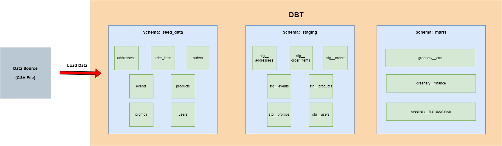

# Project Week6: สร้าง Analytics Workflow ด้วย dbt และการนำเอาแนวคิด Analytics Engineering มาใช้

## What we do in this project?
- We will create table from our raw data (CSV files), create staging of each table and also create data marts for business unit.
- This project will be managed by DBT on PostgreSQL service.

## Data Modeling

## File in the project
1. docker-compose.yml:  Use for install PostgreSQL.
2. data's folder (5 csv files):  Data for process

## Instruction
1. Please check you path that Is is in "06-analytics-engineering/greenery_project"? 
-> If yes, please skip to the next step
-> Unless, Please run this code in terminal: $ cd 06-analytics-engineering/greenery_project
2. Install PostgreSQL:
   -> $ docker-compose up
3. Create Python Environment:
   -> $ python -m venv ENV
   -> $ source ENV/bin/activate
4. Install DBT and DBT for PostgreSQL:
   -> $ pip install dbt-core dbt-postgres
5. Initial DBT:
   -> $ dbt init
6. Create profiles.yaml in project folder (greenery). You can copy it from running this code. 
   -> $ code /home/codespace/.dbt/profiles.yml
7. Go through project folder 
   -> $ cd greenery
8. Test Debug 
   -> $ dbt debug
9. Copy all datasets from data's folder to keep in seeds folder and run below code to import data from CSV files:
   -> dbt seed
9. Run your model 
   -> dbt run
10. Test model
   -> dbt test

